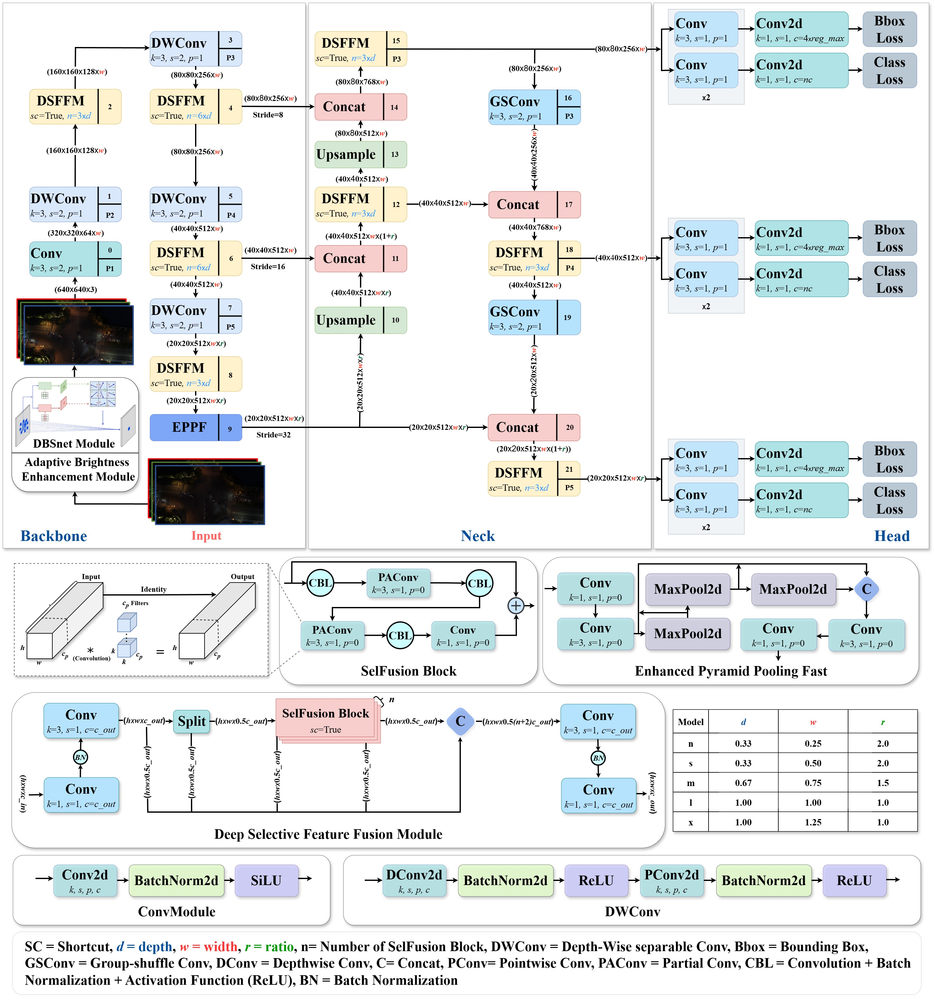
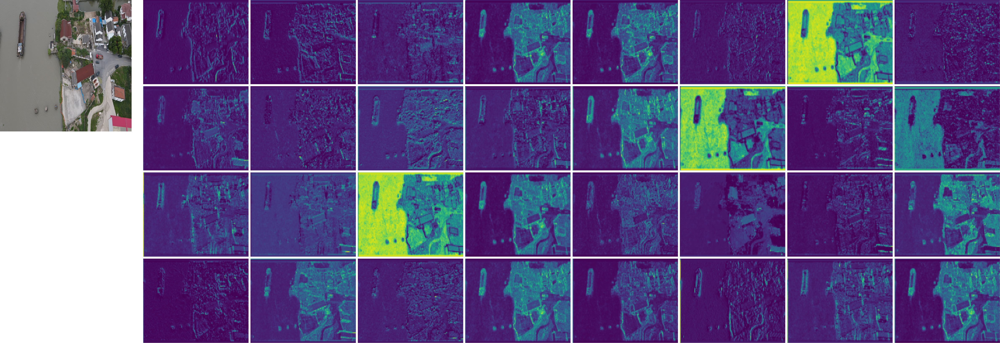
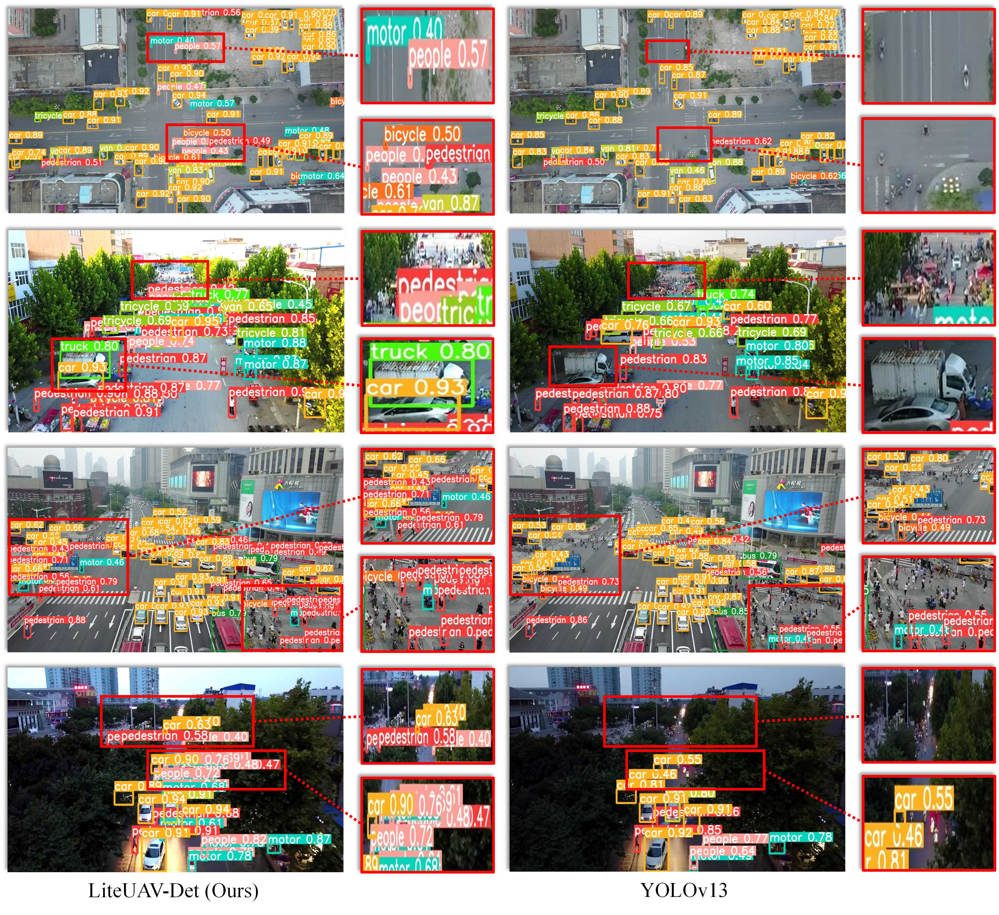

# LiteUAV-Det<br>
This repos contains the official codes for papers:<br>
<br>
**LiteUAV-Det: A Lightweight Network for Robust Small-Object Detection in Complex Aerial Scenes**<br>
[Sayed Jobaera†]([https://davidleepp.github.io](https://sayed-jobaer.github.io/)/), A. A. M. Muzahida*, Muhammad Ather Iqbal Hussaind†, F. Ahmed†, Xiaoshan Bai and Ferdous Sohel<br>
<ins>†</ins> *Equal contribution*<br>
Under Review <br>
[[Paper]()]<br>
<br>

<p align="center">
  
</p>


## Prerequisites<br>
The code written in pytorch, and their corresponding configurations are as follows:
* All deep networks run under Ubuntu 18.04
  * Python >=3.7
  * Pytorch >=1.8.0 

## 📄 Introduction

Small-object detection from unmanned aerial vehicle (UAV) imagery is a challenging task due to high flight altitude, limited object pixels, motion blur, illumination variation, and cluttered backgrounds. Conventional object detectors often struggle in such scenarios, as they are primarily optimized for medium- and large-scale objects.

To address these challenges, we propose **LiteUAV-Det**, a **lightweight and efficient object detection network** designed specifically for **robust small-object detection in complex aerial scenes**. The proposed architecture focuses on preserving fine-grained spatial features while maintaining low computational complexity, making it suitable for real-time deployment on resource-constrained platforms.

LiteUAV-Det introduces architectural optimizations that balance accuracy and efficiency, enabling effective detection of small objects under diverse aerial conditions such as urban environments, traffic scenes, and crowded areas. Experimental results demonstrate that LiteUAV-Det achieves competitive detection accuracy while significantly reducing model size and computational cost.

---

## 🧠 Network Overview

LiteUAV-Det is designed with the following goals:
- Enhanced small-object feature representation
- Lightweight computation for real-time inference
- Robust performance in complex aerial backgrounds

The architecture emphasizes efficient feature extraction and multi-scale representation to ensure reliable detection of small targets in UAV imagery.

---
                                                                                                                                                            >
***<p align="center">Architecture of LiteUAV-Det***<br><br>
<br><br>
***<p align="center">The detailed demonstration of feature map***<br><br>
<br><br>
***<p align="center">Detection results in SOD Dataset***<br><br>
<br><br>
***<p align="center">Detection results in visdrone Dataset***<br><br>
<br><br>

## Quick Start<br>

```bash
git clone https://github.com/dhuvisionlab/LiteUAV-Det.git
cd LiteUAV-Det
pip install -r requirements.txt
```


## Original_Dataset<br>
To evaluate the performance of LiteUAV-Det, a dedicated aerial dataset was constructed focusing on **small-object detection in complex scenes**.

The dataset was collected using UAV-mounted cameras under real-world flight conditions. Image acquisition was performed at varying altitudes, viewpoints, and illumination settings to capture diverse aerial environments. The dataset includes scenes such as roads, traffic intersections, open areas, and urban backgrounds, where objects appear small, densely distributed, and often partially occluded.

All images were manually annotated with bounding boxes to ensure accurate localization of small objects. The dataset includes multiple object categories commonly encountered in aerial surveillance and monitoring tasks. During preprocessing, images are resized to a fixed resolution to maintain consistency across training and evaluation.

The dataset presents significant challenges, including:
- Extremely small object sizes
- High background complexity
- Scale variation and occlusion
- Motion blur and illumination changes

These characteristics make the dataset well-suited for benchmarking lightweight UAV-based object detection models.

---

***<p align="center">Some sample images from our jute diseases and pests dataset***<br><br>
<br><br>

### Data_preprocessing<br>
Raw data needs to be preprocessed before it can be fed into networks for training or testing. First, we apply image pre-processing methods such as brightness correction and image filtering on sample images to enhance the quality of the dataset. Then, an annotation software called ‘LabelImg’ was used to draw the ground truth bounding boxes of the disease or pests in all images. Visit this link to download the LabelImg: https://github.com/HumanSignal/labelImg <be>

### Data_Download<br>
Visit this link to download the dataset: https://github.com/dhuvisionlab/SODNet

## Acknowledgement
Part of our code was descended and modified from the open-source code by ultralytics. Their original code can be found at: [https://github.com/ultralytics/yolov5.git].


## Citation<br>
Please consider citing our papers if the project helps your research with the following BibTex:
```
@article{jobaer2022liteuavdet,
  title={LiteUAV-Det: A Lightweight Network for Robust Small-Object Detection in Complex Aerial Scenes},
  author={},
  journal={},
  year={}
}

```
